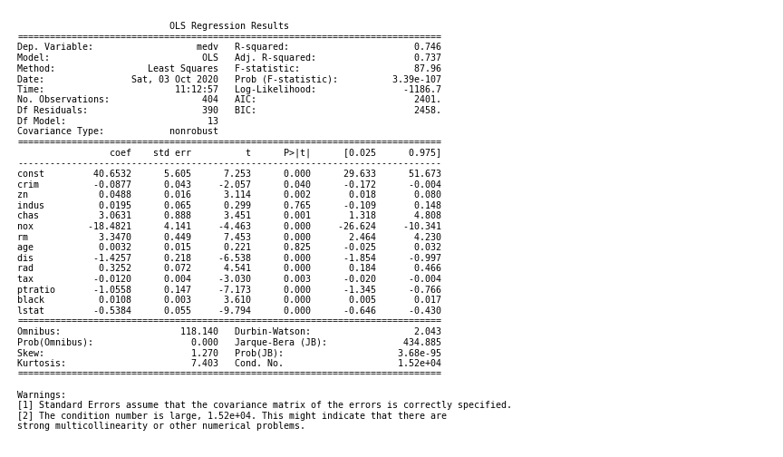
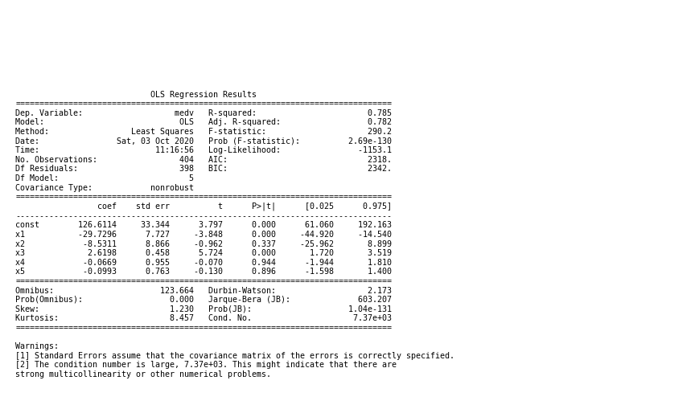

## Data Analysis and Visualisation to predict House Price (Use of Polynomial Regression)

In this project I'm trying to analyze and visualize the Most Famous Example i.e House Price Prediction from the dataset in order to predict the most probable House Price Value.

## Data Description

    CRIM - per capita crime rate by town
    ZN - proportion of residential land zoned for lots over 25,000 sq.ft.
    INDUS - proportion of non-retail business acres per town.
    CHAS - Charles River dummy variable (1 if tract bounds river; 0 otherwise)
    NOX - nitric oxides concentration (parts per 10 million)
    RM - average number of rooms per dwelling
    AGE - proportion of owner-occupied units built prior to 1940
    DIS - weighted distances to five Boston employment centres
    RAD - index of accessibility to radial highways
    TAX - full-value property-tax rate per dollar 10,000
    PTRATIO - pupil-teacher ratio by town
    B - 1000(Bk - 0.63)^2 where Bk is the proportion of blacks by town
    LSTAT - Percentage lower status of the population
    MEDV - Median value of owner-occupied homes in dollar 1000's
    

## Process
    
    1) Reading the raw file
    
    2) Removing unwanted columns
    
    3) Univariate Analysis for deeper look in each parameter
    
    4) Bi Variate Analysis for looking into linearity
    
    5) Multi Variate Analysis for selecting relevant features
    
## Modelling

    1) Modelling using linear regression
    
    2) Modelling using linear Polynomial regression
    
    3) Selecting and tuning model to get better results
    
    4)Error evalutions   
    
## Softwares and Libraries Used:

       - Anaconda Distribution
	- Jupyter Notebook
	
	- Numpy
	- Pandas
	- Matplotlib
	- Seaborn
    - sklearn 
    - statsmodels
    - warnings
    
## Importing the Modules:

    import pandas as pd
    import os as os
    import numpy as np

    #Visuals
    import matplotlib.pyplot as plt
    import seaborn as sns

    #To split data
    from sklearn.model_selection import train_test_split

    # Models
    import statsmodels.api as sm
    from sklearn.linear_model import LinearRegression
    
    # Evalution 
    from sklearn.metrics import mean_squared_error, r2_score
    from scipy.stats import zscore
    
    import warnings
    warnings.filterwarnings("ignore")
    
## Analysis:

1)Univariant Analysis

2)Bivariant Analysis

3)Correlation Using HeatMap

4)Model 1 : OLS with All Feature

	
	Rsquare value is around 74%
	But most feature have P value higher than 0.05 example age(p-value=0.825) and indus(p-value=0.765)

5)Model 2: OLS dropping waste columns (indus, age)

    	
	Thus after removing indus and age the R-square value is some what same i.e 74%.
	We can see that age and indus does not add any value.

6)Model 3: OLS with LSTAT only

  	
	Consider feature which is highly correlated with output variable i.e lstat.
    	We can see that lstat gives around 55% accuracy

7)Model 4: OLS with LSTAT & RM only

	R square value using lstat and rm is around 63%. Thus rm is also an important feature and contributes to output variable.

## Polynomial Regression:

8)Model 5: OLS with LSTAT & LSTAT polynominal features

	Thats approx 64% accuracy with LSTAT and its 2 degree feature (x square), but it should not overfit.. To test the overfit we need new 
    	data to check performance on Test Data also

9)Model 6: OLS with LSTAT, RM & LSTAT,RM polynominal features

   	Manipulate some outlier of OLS(by doing log transformation) and Rm(replacing by mode)
   	Thus R-squar value for train is around 78% and test is 75%
   

10)Error Distribution:

## Concluding statement 
    
   Using Polynominal regression we achieved 77.5% on train dataset & 79% on test data..
    
